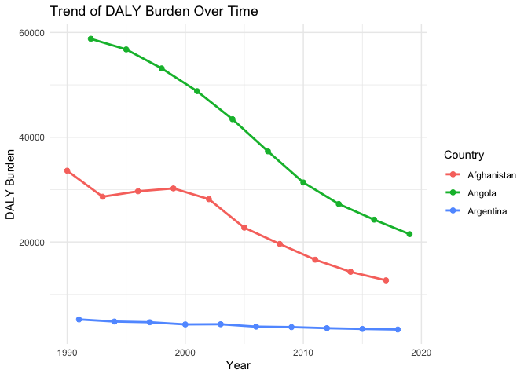

Global Disease Burden Analysis
================
Muna Aden

# Introduction

This document compares the Disability-Adjusted Life Year (DALY) diseases
burden for three countries: COUNTRY 1, COUNTRY 2, and COUNTRY 3. We
compare the burden due to communicable, maternal, neonatal, and
nutritional diseases (CMNN), non-communicable diseases (NCDs), and
overall disease burden for these countries.

The source data is from the Institute for Health Metrics and Evaluation
(IHME) Global Burden of Disease (GBD) study.

# Communicable, Maternal, Neonatal, and Nutritional Disease Burden (CMNN)

## Table of Estimates for CMNN Burden Over Time

| Code | Year | Afghanistan |   Angola | Argentina |
|:-----|-----:|------------:|---------:|----------:|
| AFG  | 1990 |    33619.14 |       NA |        NA |
| AFG  | 1993 |    28650.05 |       NA |        NA |
| AFG  | 1996 |    29690.18 |       NA |        NA |
| AFG  | 1999 |    30236.85 |       NA |        NA |
| AFG  | 2002 |    28184.19 |       NA |        NA |
| AFG  | 2005 |    22735.86 |       NA |        NA |
| AFG  | 2008 |    19625.52 |       NA |        NA |
| AFG  | 2011 |    16626.51 |       NA |        NA |
| AFG  | 2014 |    14306.13 |       NA |        NA |
| AFG  | 2017 |    12683.09 |       NA |        NA |
| AGO  | 1992 |          NA | 58790.54 |        NA |
| AGO  | 1995 |          NA | 56765.55 |        NA |
| AGO  | 1998 |          NA | 53145.02 |        NA |
| AGO  | 2001 |          NA | 48792.86 |        NA |
| AGO  | 2004 |          NA | 43447.86 |        NA |
| AGO  | 2007 |          NA | 37318.36 |        NA |
| AGO  | 2010 |          NA | 31372.28 |        NA |
| AGO  | 2013 |          NA | 27260.90 |        NA |
| AGO  | 2016 |          NA | 24262.38 |        NA |
| AGO  | 2019 |          NA | 21500.33 |        NA |
| ARG  | 1991 |          NA |       NA |  5230.737 |
| ARG  | 1994 |          NA |       NA |  4826.627 |
| ARG  | 1997 |          NA |       NA |  4691.510 |
| ARG  | 2000 |          NA |       NA |  4277.004 |
| ARG  | 2003 |          NA |       NA |  4311.924 |
| ARG  | 2006 |          NA |       NA |  3854.922 |
| ARG  | 2009 |          NA |       NA |  3765.609 |
| ARG  | 2012 |          NA |       NA |  3564.265 |
| ARG  | 2015 |          NA |       NA |  3418.012 |
| ARG  | 2018 |          NA |       NA |  3307.472 |

DALY Burden Over Time for Data

## Plot Showing Trends in CMNN Burden Over Time

    ## Warning: Using `size` aesthetic for lines was deprecated in ggplot2 3.4.0.
    ## ℹ Please use `linewidth` instead.
    ## This warning is displayed once every 8 hours.
    ## Call `lifecycle::last_lifecycle_warnings()` to see where this warning was
    ## generated.

<!-- -->

## Summary of CMNN Burden Findings

Angola’s DALY Burden has been decreasing gradually since 1990. This is
the country that had the highest DALY in 1990. Afghanistans DALY Burden
has also been decreasing gradually even though not at a consistent rate
as Angola. Finally, Argentina has always had the lowest DALY Burden
which has also been gradually reducing since 1990.

# Non-Communicable Disease Burden (NCD)

## Table of Estimates for NCD Burden Over Time

## Plot Showing Trends in NCD Burden Over Time

## Summary of NCD Burden Findings

Provide a brief analysis based on the data presented in the table and
chart. Highlight any significant findings or patterns. About 3
sentences.

# Overall Disease Burden

## Table of Estimates for Overall Disease Burden Over Time

## Plot Showing Trends in Overall Disease Burden Over Time

## Summary of Overall Disease Burden Findings

Provide a brief analysis based on the data presented in the table and
chart. Highlight any significant findings or patterns. About 3
sentences.
